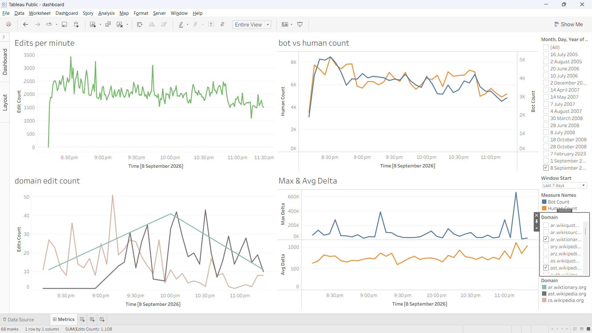

# Wikimedia Streaming Analytics

A real-time data pipeline that turns live [Wikimedia Recent Changes](https://stream.wikimedia.org/v2/stream/recentchange) events into analytics-ready datasets.

## Architecture

`Wikimedia EventStreams -> Python producer -> Kafka -> Spark Structured Streaming -> Parquet`

The pipeline uses a medallion-style layout:

- **Bronze:** raw Kafka messages and ingestion metadata
- **Silver:** typed, validated edit events with derived edit-size deltas
- **Gold:** event-time windowed metrics for edit volume, bot vs. human activity, domains, and edit deltas

## Stack

Python, Apache Kafka, Spark Structured Streaming, Docker Compose, Parquet, DuckDB, and Tableau.

## Key features

- Ingests live Wikimedia SSE events into Kafka
- Uses Spark checkpoints for recoverable streaming jobs
- Applies event-time watermarks and 1-/5-minute window aggregations
- Exports curated datasets for analysis and dashboarding

## Run locally

From `wiki-stream-analytics`:

1. Start Kafka and Kafka UI: `docker compose up -d`
2. Run `python producer/producer.py` to publish events to the `wiki_events` topic.
3. Submit the Spark jobs in order: `spark_jobs/bronze_job.py`, `spark_jobs/silver_job.py`, then `spark_jobs/gold_job.py`.

Kafka UI is available at `http://localhost:8080`.

## Dashboard

The Tableau workbook and preview are in [`wiki-stream-analytics/dashboard`](dashboard).

